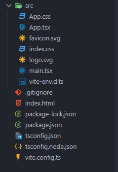
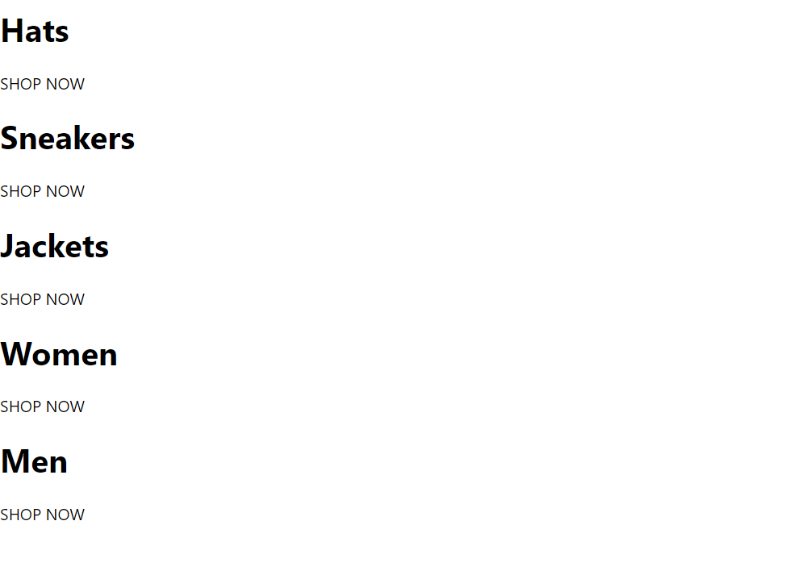
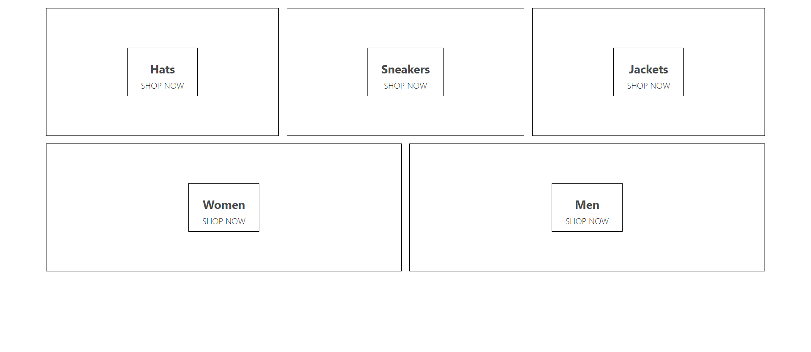

- [let's create a create a new project using vite](#lets-create-a-create-a-new-project-using-vite)
  - [create project](#create-project)
  - [clean up the project](#clean-up-the-project)

## let's create a create a new project using vite

### create project

```bash
$ npm create vite@latest
```

the default project folder structure is as follows:



to run the application

```bash
$ cd e-commerce
$ npm run dev
```

### clean up the project

clear the `App.css` file

and `App.tsx` file

```tsx
import './App.css';

function App() {
  return <div className="App">Hello</div>;
}

export default App;
```

let's create a `homepage.component.tsx` file

```tsx
const HomePage = () => {
  return (
    <div className="homepage">
      <div className="directory-menu">
        <div className="menu-item">
          <div className="content">
            <h1 className="title">Hats</h1>
            <span className="subtitle">SHOP NOW</span>
          </div>
        </div>

        <div className="menu-item">
          <div className="content">
            <h1 className="title">Sneakers</h1>
            <span className="subtitle">SHOP NOW</span>
          </div>
        </div>
        <div className="menu-item">
          <div className="content">
            <h1 className="title">Jackets</h1>
            <span className="subtitle">SHOP NOW</span>
          </div>
        </div>
        <div className="menu-item">
          <div className="content">
            <h1 className="title">Women</h1>
            <span className="subtitle">SHOP NOW</span>
          </div>
        </div>
        <div className="menu-item">
          <div className="content">
            <h1 className="title">Men</h1>
            <span className="subtitle">SHOP NOW</span>
          </div>
        </div>
      </div>
    </div>
  );
};

export default HomePage;
```

output



let's add `Sass` to our project
add sass as a dev dependency

```bash
npm add -D sass
```

let's create a `homepage.styles.scss` file

```scss
.homepage {
  display: flex;
  flex-direction: column;
  align-items: center;
  padding: 20px 80px;
}

.directory-menu {
  width: 100%;
  display: flex;
  flex-wrap: wrap;
  justify-content: space-between;
  border: 1px solid black;
}

.menu-item {
  min-width: 30%;
  height: 240px;
  flex: 1 1 auto;
  display: flex;
  align-items: center;
  justify-content: center;
  border: 1px solid black;
  margin: 0 7.5px 15px;
  &:first-child {
    margin-right: 7.5px;
  }
  &:last-child {
    margin-left: 7.5px;
  }

  .content {
    height: 90px;
    padding: 0 25px;
    display: flex;
    flex-direction: column;
    align-items: center;
    justify-content: center;
    border: 1px solid black;

    .title {
      font-weight: bold;
      margin-bottom: 6px;
      font-size: 22px;
      color: #4a4a4a;
    }

    .subtitle {
      font-weight: lighter;
      font-size: 16px;
    }
  }
}
```

output


